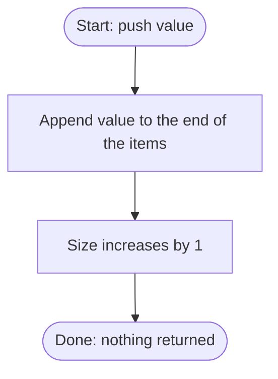

# push

Adds a value to the top of the stack.

```mermaid
flowchart TD
  A([Start: push value]) --> B[Append value to the end of the items]
  B --> C[Size increases by 1]
  C --> D([Done: nothing returned])
```

## Before / after

| | Stack (bottom to top) | Size |
|---|---|---|
| Before | `[1, 2]` | 2 |
| After `push(3)` | `[1, 2, 3]` | 3 |
